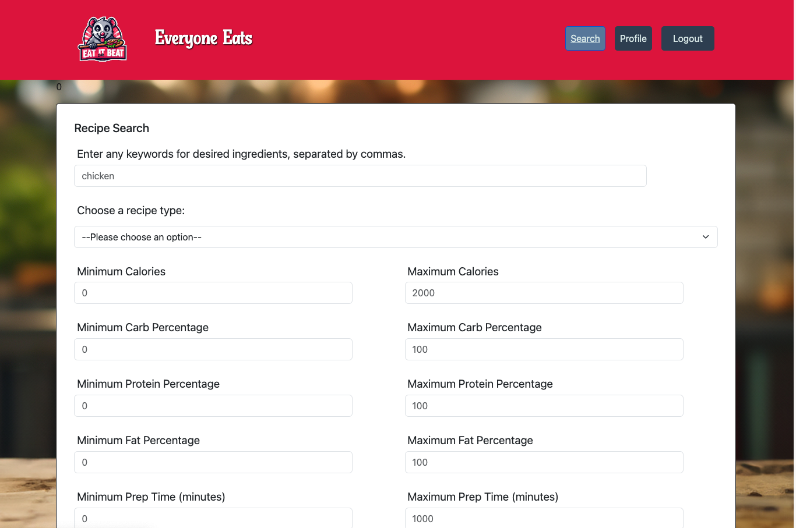
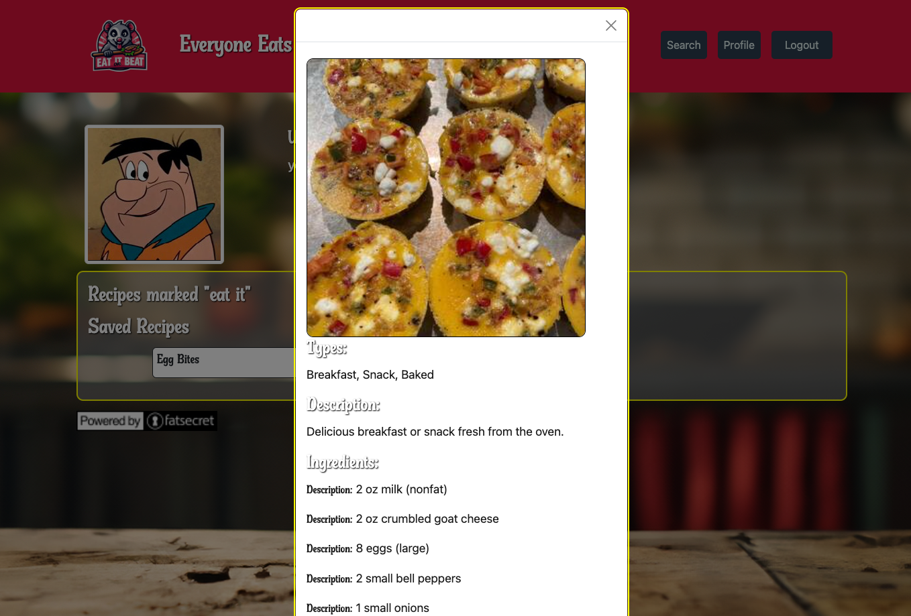
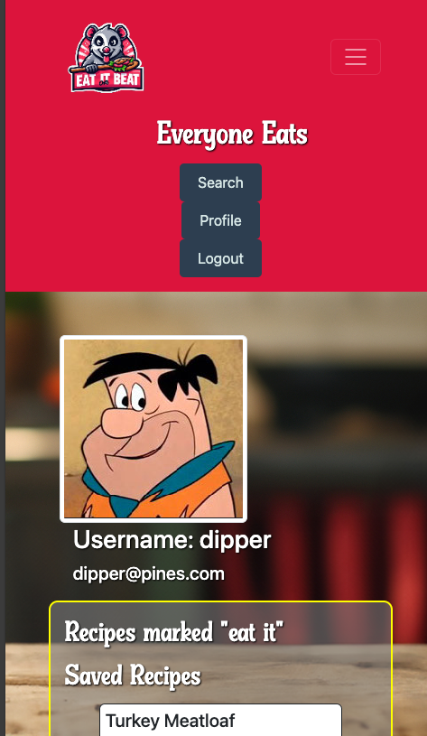

# Eat It, Or Beat It!
A Containerized fork of a collaborative project: a website (using the MERN stack and the FatSecret API) where users can create a secure account and login to search for and build meal and recipe plans, ready to use in the kitchen! This work was completed by Lothy Gresser, Jonathan Grommesh, Tanner Johnson, Nash Peterson, &amp; Tim Scallon. Tim handled this containerization fork.

  ## Table of Contents
  - [Description](#description)
  - [Installation](#installation)
  - [Usage](#usage)
  - [Contributing](#contributing)
  - [Tests](#tests)
  - [License](#license)
  - [Credits](#credits)
  - [Questions](#questions)

  ## Description
  Everybody Eats! But some of us have a healthier or less healthy relationship with food - perhaps the only addictive substance truly needed to stay alive. This website will allow securely registered users to learn more about the foods they eat and make better decisions on their next grocery run or kitchen adventure. Whether you're a nutrition guru already or just getting back into the swing of things, Everybody Eats offers the tools to succeed nutritionally! In the future, we have considered the potential for expanding the profile and setting up romantic 'matches' between users who have liked the same food... Why not cook it together? ❤️

  ### Homepage/Login
  
  ### User Profile
  
  ### Search Form
  
  ### Eat it or Beat it!
  
  ### Recipe Card on Profile
  
  ### Mobile View
  

  ## Installation
  To install this project after copying down the repo, you will first need to run `npm install` (-y for default settings) on the project root, which should grant you access to the necessary libraries listed in the package.json files for the root, client, and server. Installation instructions for using the container yourself, tbd.

  ## Usage
  1. To use this project, you'll want to be familiar with MongoDB; Technically GraphQL is enabled, but we did not use it much in our design and implementation.
  2. You will also need to make a FatSecret account so you have the two necessary API keys. To deploy online, you'll need a server hosting service like MongoDB Atlas to get your MONGODB_URI environment variable.
  3. Rename the `.env` file and fill in the appropriate info - the CONSUMER_KEY and CONSUMER_SECRET are your personal FatSecret API keys; both are needed. The calls in this project rely on OAuth1.0, meaning you can't get around making an account with them.
  5. On that same node terminal, run `npm run develop` - the server will boot and the site can be explored locally!

  [You can also run from our deployed application on Render - at least while it's spun up!](https://project-03-yel1.onrender.com)

  ## Contributing
  If you want to contribute to this project - particularly if you want to work with us on expanding our database into more of a social network type vibe, see our contact info in the Questions section below (Nash owns the repo, but all five of the devs have essentially admin access to it). Don’t hesitate to reach out!

  ## Tests
  This project can and should be tested using localhost and `npm run develop`. You will need to run a build if you wish to deploy your version.
  
  ## Credits
  - Big shoutouts to our teacher Gary and our TA, Katy!
  - External Recipe API owned and operated by FatSecret; used with permission and - by the end of the project - some resentment.

  ## Questions
  ### For Lothy:
  - [My Github!](https://github.com/lothylg)
  - [Email Me](mailto:lothygresser@gmail.com?subject=Hello!)
  ### For Jonathan:
  - [My Github!](https://github.com/JonGrom)
  - [Email Me](mailto:grommeshjonathan@gmail.com?subject=Hello!)
  ### For Tanner:
  - [My Github!](https://github.com/tjjohnson76)
  - [Email Me](mailto:tannerjohnson08@gmail.com?subject=Hello!)
  ### For Nash:
  - [My Github!](https://github.com/TeutonicTed)
  - [Email Me](mailto:npeters021@gmail.com?subject=Hello!)
  ### For Tim:
  - [My Github!](https://www.github.com/floatingpoint-exaflop)
  - [Email Me](mailto:timscallon1@gmail.com?subject=Hello!)

  ## License
  
  
  This project is using the MIT License. Please click the badge icon for more information, or refer directly to the LICENSE in the repo.